# PhaseFinder Code Flow Diagrams

These diagrams document the current ES-module browser application. They
separate module topology, state ownership, FCS data
loading, the QC and cell-cycle modeling pipeline, rendering, and session restore
so each diagram remains useful at a readable scale.

Key architectural facts:

- `index.html` loads one module entry, `js/main.js`; imports define runtime
  ordering after the explicit `init_*()` bootstrap.
- D3 is the only vendored third-party module. Peak detection and nonlinear
  fitting are repository-native modules under `js/analysis/cell_cycle/`.
- `pipeline_loader.js` lazy-loads `pipeline/cell_cycle_pipeline.js` on the first QC/modeling action.
  Pipeline UI, state-aware rendering, and the Stage 2 scatter viewer are part of
  the eager application shell.
- Loaded event channels remain full-length and aligned to original FCS event
  indexes. Stage 0–3 masks are composed without compacting those arrays.
- Pipeline state is per sample and guarded by row id, channel key, and event
  count. Re-running an upstream stage invalidates every downstream product.
- The `render_density_plot()` pass reads stored pipeline outputs; it never fits
  a model. (The peak-region drag handler installed by that pass does refit the
  one edited sample, but only on commit, after the pass has returned.)

## 1. Runtime module topology

Solid arrows are ordinary ES imports. Dashed arrows identify a dynamic import
or a module worker boundary. The diagram shows responsibility regions rather
than claiming a strictly acyclic import graph—plot rendering and initialization
contain a few intentional ES-module cycles.

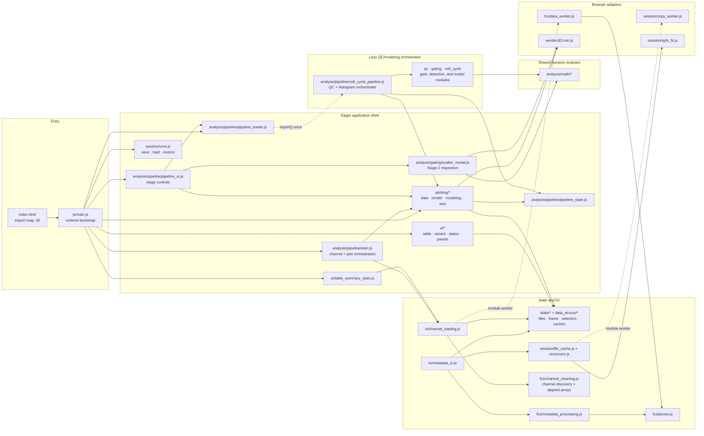

## 2. Ordered startup bootstrap

Module evaluation resolves imports first. The explicit bootstrap then installs
listeners in a deliberate order and finally publishes the debug/automation
hook. Both `pipeline` and the compatibility alias `djf` are null until the
pipeline core has actually loaded.

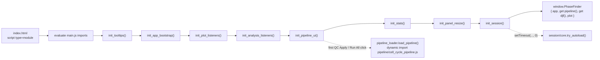

## 3. State ownership and runtime contracts

Direct imports handle most communication. Custom events are used where one user
action has multiple downstream consumers. Pipeline masks/results are runtime
state and are intentionally not part of session serialization.

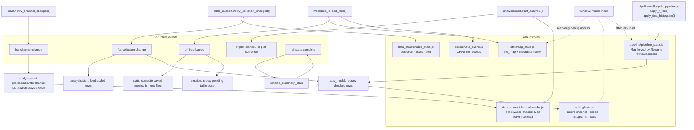

## 4. Two-phase FCS loading

Initial file load reads only HEADER/TEXT metadata. Event DATA is loaded later,
in batches, when a DNA-area channel is plotted. All pipeline companion channels
are loaded together and retained as original-index `Float64Array` values.

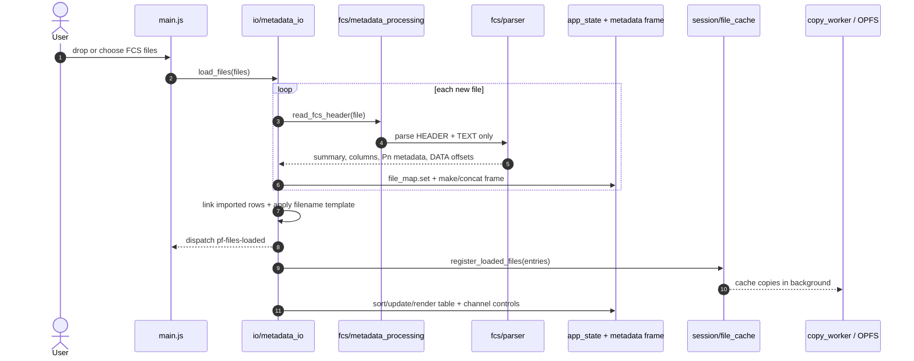

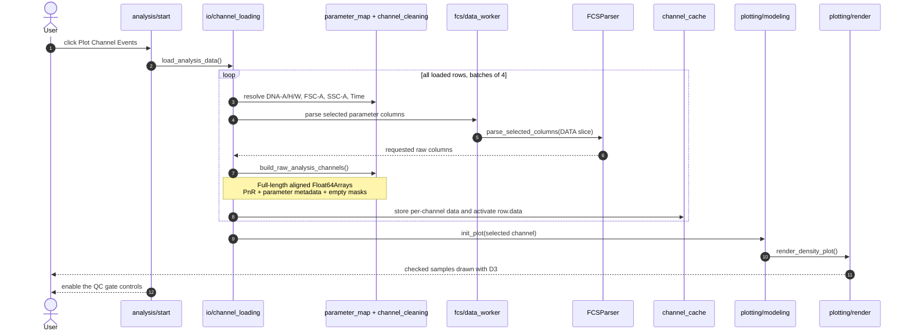

## 5. QC and cell-cycle modeling dataflow

Stages 1–3 are optional. When their required channels are unavailable, their
mask slot remains null and prior masks still apply. Everything downstream of the
Stage 4 histogram is model-neutral: peak detection proposes G1/G2 regions, the
user accepts or edits them, and whichever registered model the user picked reads
the histogram plus those regions. Peak regions identify peaks — they are not
phase gates, and the optimizer may never move them.

```mermaid
flowchart LR
  RAW["Raw original-index channels<br/>DNA-A/H/W · FSC-A · SSC-A · Time"] --> S0["Stage 0<br/>Structural QC<br/>structural mask"]
  S0 --> S1["Stage 1 optional<br/>Time QC<br/>time mask or null"]
  S1 --> S2["Stage 2 optional<br/>FSC/SSC GMM<br/>scatter mask or null"]
  S2 --> S3["Stage 3 optional<br/>pulse-geometry ridge<br/>singlet mask or null"]
  S3 --> FINAL["Final mask<br/>AND all non-null masks"]
  FINAL --> S4["Stage 4<br/>shared-range DNA histogram"]
  S4 --> DETECT["modeling_state.detect_peak_regions()<br/>multi-scale G1/G2 pair detection"]
  DETECT --> REGIONS["modeling.peakSelection.regions<br/>accepted or manually edited"]
  S4 --> FIT["modeling_state.fit_cell_cycle_model(row, modelId)<br/>registry lookup · preflight · worker fit"]
  REGIONS --> FIT
  FIT --> CONTRACT["result_contract.apply_result_contract()<br/>validForReporting · fractions · GoF · warnings"]
  CONTRACT --> STORE["modeling.resultsByKey"]
  JOINT["CLOCCS · fitScope joint_series<br/>run_cloccs_joint_fit() over a strain's timepoints"] -.-> STORE
```

## 6. QC application and fit orchestration

There are no stage-number buttons. The QC panel applies whichever gates are
checked across all plottable samples in one pass, then rebuilds every histogram
so the modeling panel always reads fresh, correctly filtered bins. Fitting is a
separate, explicitly chosen action: the model dropdown opens on a placeholder,
so both Fit buttons stay disabled until the user picks a model.

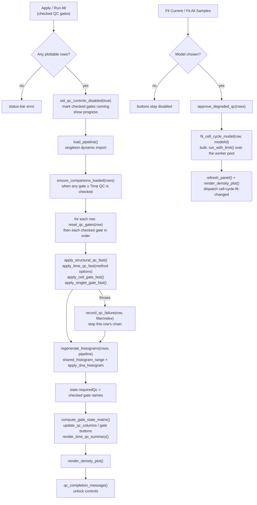

## 7. State-aware render path

The render pass chooses the newest valid stored checkpoint for each active row.
It does not call any numerical stage function.

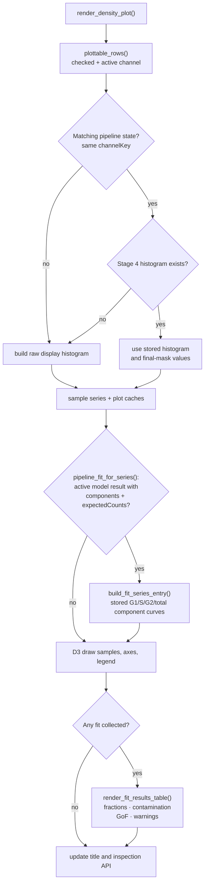

## 8. Session save, load, and reconnect

Sessions serialize metadata, table state, channel/plot settings, statistics
plans, file records, and layout. QC masks, fits, and reports are runtime-only;
legacy correction flags are written as false for compatibility.

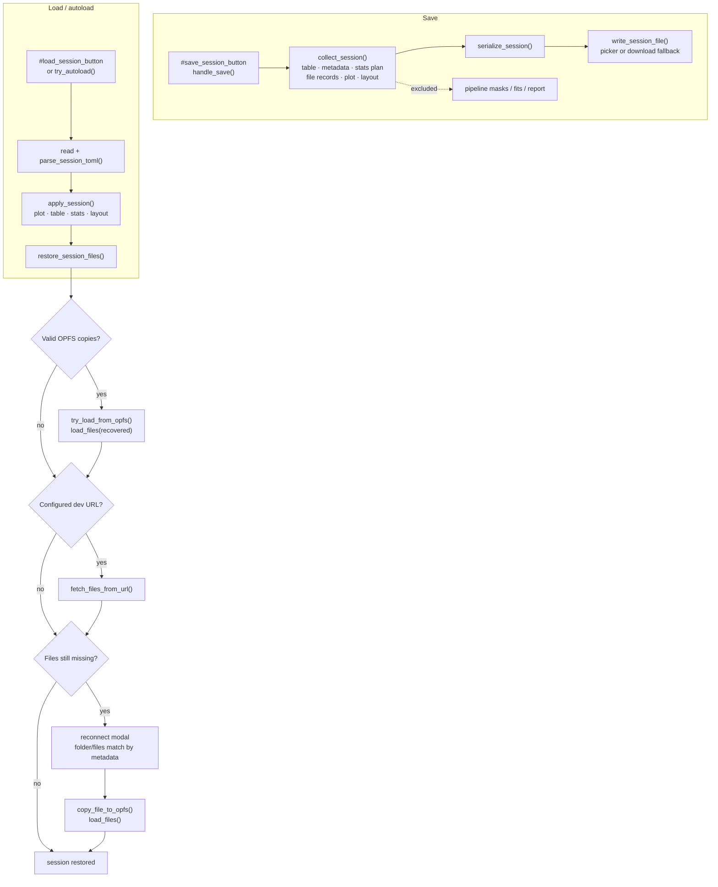

## 9. Production build and deployment

The reviewed Vite artifact is the deployment unit. Release jobs do not rebuild
after inspection: checksums, manifest, SBOM, build metadata, and deployed files
all describe the same `dist/` tree.

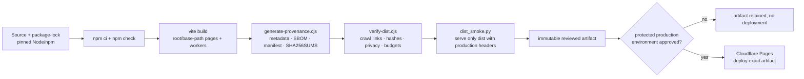

## 10. Time QC variants and effective settings

Both Time QC methods use one validated settings contract, but retain independent
drafts and algorithm identities. Apply commits atomically; Cancel never changes
live settings or masks.

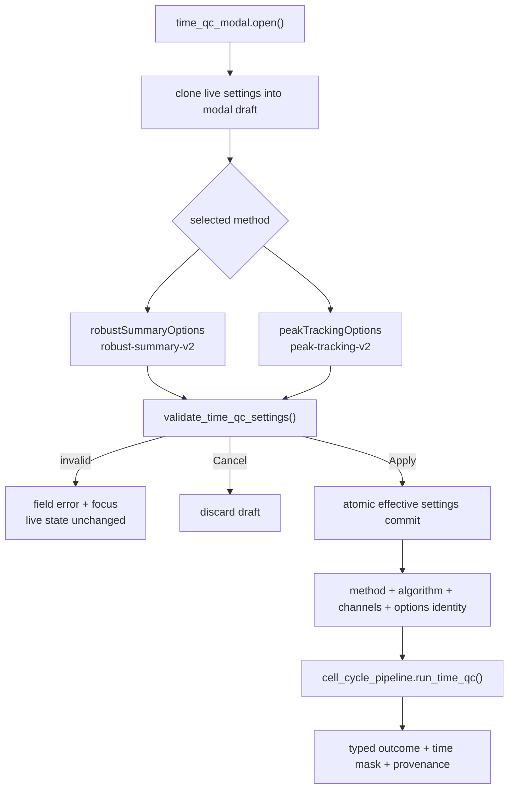

## 11. Canonical model state and worker boundary

Per-sample modeling state owns reviewed regions, settings, histogram identity,
revision, and versioned results. A fit worker returns calculation output only;
the shared state entry point rejects cancelled, superseded, or stale input
before mutating active/cached results.

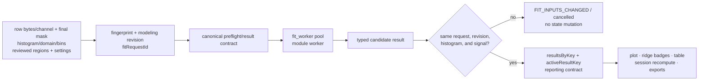

## 12. OPFS index and cache lifecycle

The cache index is versioned and atomically written. Each logical session owns
references to content-verified files; Reset/release removes only objects no
longer referenced by another session.

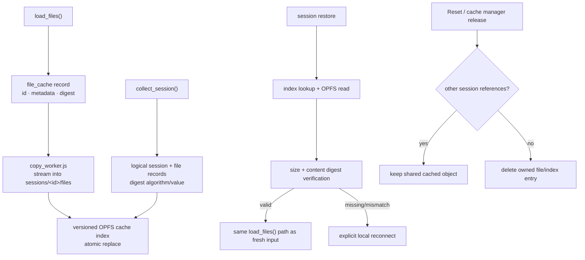
