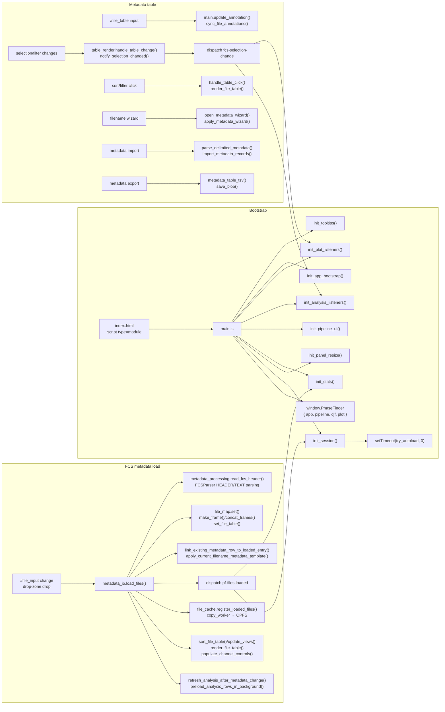
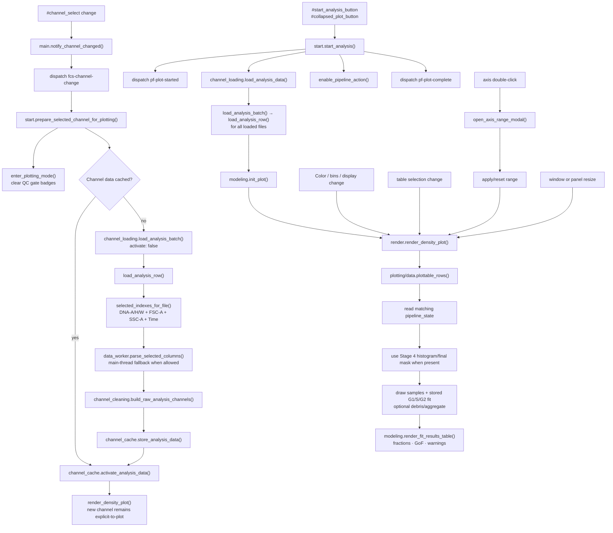
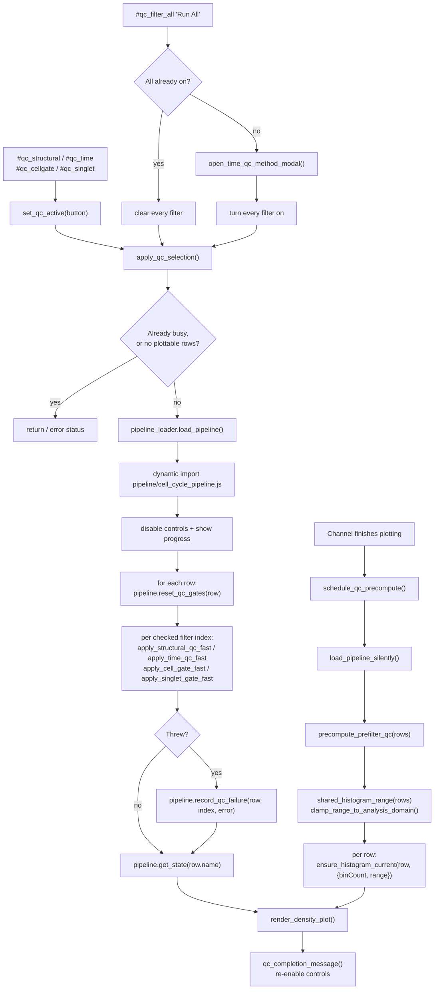
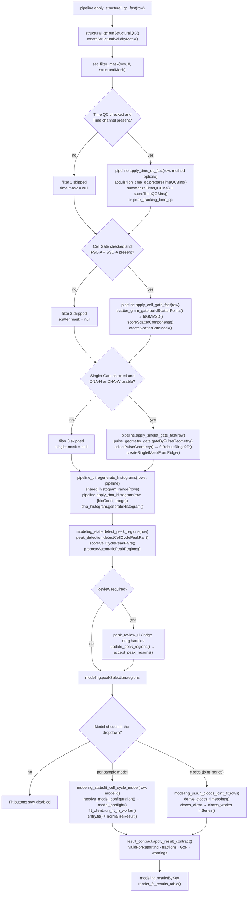
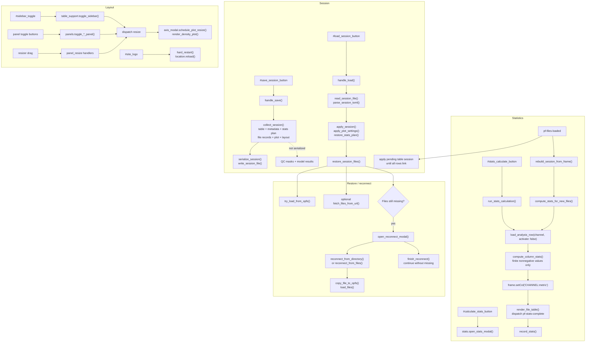
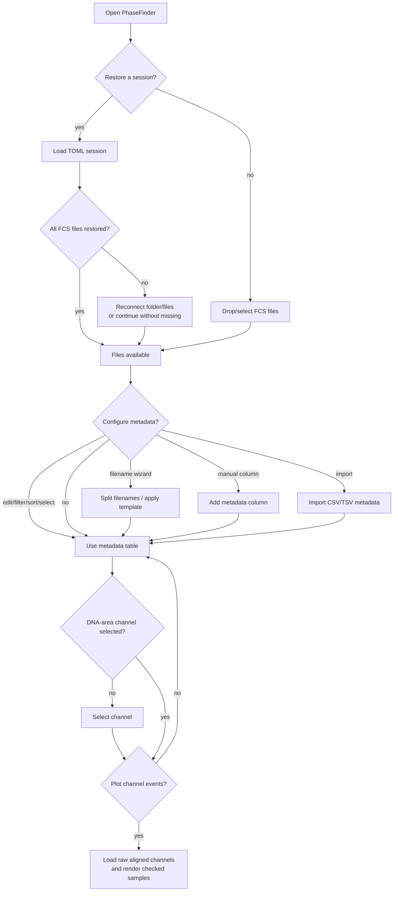
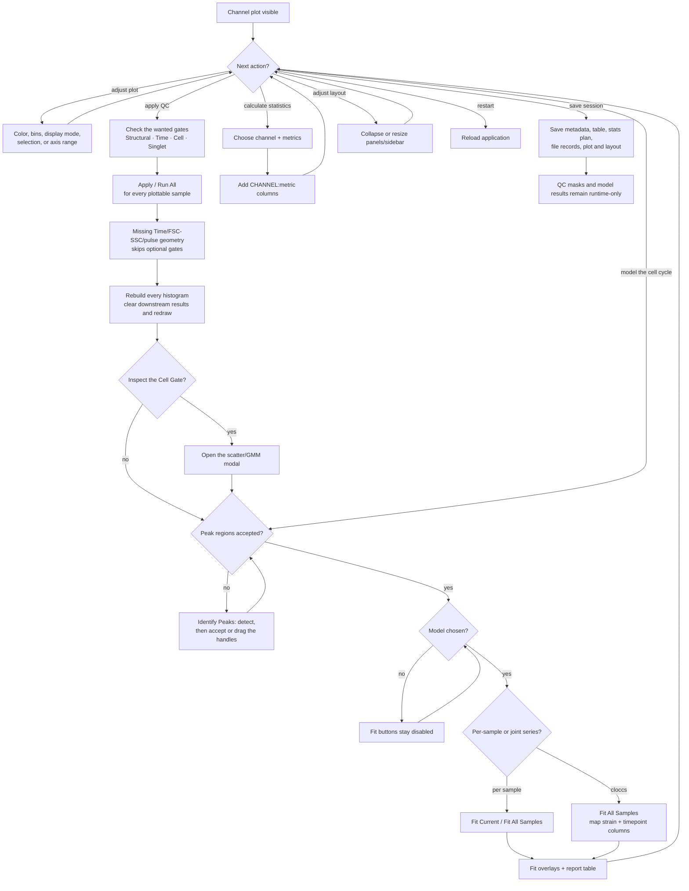

# PhaseFinder Function Calls And User Decisions

These graphs map user-facing controls to concrete module functions in the
current application. They intentionally separate setup, channel/plot loading,
QC orchestration, numerical gates, state invalidation, and session/statistics
flows so function names remain readable.

Important distinctions reflected below:

- QC is applied as a set, not stage by stage: `pipeline_ui.apply_qc_selection()`
  resets each row's gates and then runs every *checked* filter in order. There is
  no index-based dispatcher and no stage-number buttons.
- Filter 1–3 skip paths store null optional masks, preserving upstream masks.
- Peak detection proposes G1/G2 regions; the user accepts or edits them. Regions
  are an input to fitting, and the optimizer may never move them.
- Re-applying QC invalidates downstream products before the plot redraws.
- Pipeline results are runtime-only and are not serialized in session files.

## 1. Bootstrap, file load, and metadata calls

## 2. Channel selection, event loading, and plotting calls

Changing a channel preloads/activates its cache but intentionally leaves the
plot switch explicit. Clicking Plot Channel Events loads every file so unchecked
samples can be added later without another DATA read; only checked rows render.

## 3. Pre-model QC filter UI calls

The four QC gates are independent **toggles**, not a sequential stage runner.
Toggling any of them recomposes the whole filter selection.

## 4. QC gate and modeling numerical calls

## 5. Pipeline state, masks, and invalidation calls

```mermaid
flowchart LR
  T0["Any apply_*(row) entry point"] --> T1["pipeline_state.get_or_create_state(row)"]
  T1 --> T2{"Same rowId,<br/>channelKey, eventCount?"}
  T2 -- "no" --> T3["empty_state(row)<br/>replace filename-keyed Map entry"]
  T2 -- "yes" --> T4["reuse current state"]
  T3 --> T5["write filter N product"]
  T4 --> T5

  T5 --> T6{"QC filter 0–3?"}
  T6 -- "yes" --> T7["set_filter_mask(row, N, mask or null)"]
  T7 --> T8["recompute_final_mask()<br/>AND every non-null mask"]
  T6 -- "no" --> T9["retain current final mask"]
  T8 --> T10["invalidate_after(row, state, N)"]
  T9 --> T10

  T10 --> T11["clear downstream QC products"]
  T10 --> T12["invalidate_histogram_dependents()<br/>invalidate_model_results()"]
  T12 --> T8
  T12 --> T14["render_density_plot()"]

  C0["Different row.data.channel_key"] --> C1["enter_plotting_mode()<br/>clear completion badges"]
  C1 --> C2["render.active_pipeline_state()<br/>reject mismatched old state"]
  C2 --> T1

  T14 --> V0["histogram replaces display bins"]
  T14 --> V1["get_active_model_result() overlays component curves"]
  T14 --> V2["render_fit_results_table() populates the report table"]
```

## 6. Statistics, sessions, reconnect, and layout calls

## 7. User decision tree — setup

## 8. User decision tree — analysis

## Source inventory

Entry and shared state:

- `js/main.js` — ES-module entry, listener bootstrap, and
  `window.PhaseFinder = { app, pipeline, djf, plot }`.
- `js/state/app_state.js`, `js/state/files.js` — loaded-file/frame ownership and
  selection queries.
- `js/data_structs/metadata_frame.js`, `metadata_columns.js`, `table_state.js`,
  `channel_cache.js` — table model, metadata state, and per-channel DATA caches.

FCS and IO:

- `js/fcs/parser.js` — FCS HEADER/TEXT/DATA parsing;
  `js/fcs/metadata_processing.js` — metadata-only header reads;
  `js/fcs/data_worker.js` — selected-column module worker.
- `js/fcs/channel_cleaning.js` — A/H/W/scatter/Time discovery and construction
  of aligned raw arrays, PnR values, and parameter metadata.
- `js/io/metadata_io.js`, `js/io/channel_loading.js`, `js/io/parameter_map.js` —
  file/table IO and selected-channel loading.

Cell-cycle QC pipeline:

- `js/analysis/pipeline/pipeline_loader.js`, `pipeline_ui.js`, `pipeline_state.js`,
  `cell_cycle_pipeline.js`, and `js/analysis/gating/scatter_modal.js` — lazy
  loading, QC filter controls, state/masks, stage orchestration, and Cell Gate
  inspection.
- `qc/structural_qc.js`, `qc/acquisition_time_qc.js`,
  `gating/scatter_gmm_gate.js`, `gating/pulse_geometry_gate.js`, and
  `pipeline/dna_histogram.js` — the canonical Stage 0–4 checkpoints;
  `cell_cycle/peak_detection.js`, `cell_cycle/peak_regions.js`,
  `cell_cycle/model_registry.js`, `cell_cycle/models/*.js`,
  `cell_cycle/fit_client.js`/`fit_worker.js`, and
  `cell_cycle/result_contract.js` — detection, model registration, off-thread
  fitting, and the reportability gate.
- `math/{stats,gaussian,gaussian_bin_mass,poisson,linalg2d,lm_solver,nelder_mead,integrate,quadrature}.js`
  — shared numerical implementation.

Rendering, analysis, and persistence:

- `js/plotting/data.js`, `render.js`, `modeling.js`, `axis_modal.js` — D3 plot
  state/rendering, staged fit/report presentation, and axis/inspection API.
- `js/analysis/pipeline/start.js`, `stats.js` — channel/plot workflow and summary stats.
- `js/session/core.js`, `table_session.js`, `file_cache.js`, `reconnect.js`,
  `opfs_fs.js`, `copy_worker.js`, `toml_io.js` — session serialization, OPFS
  caching, and reconnect orchestration.
